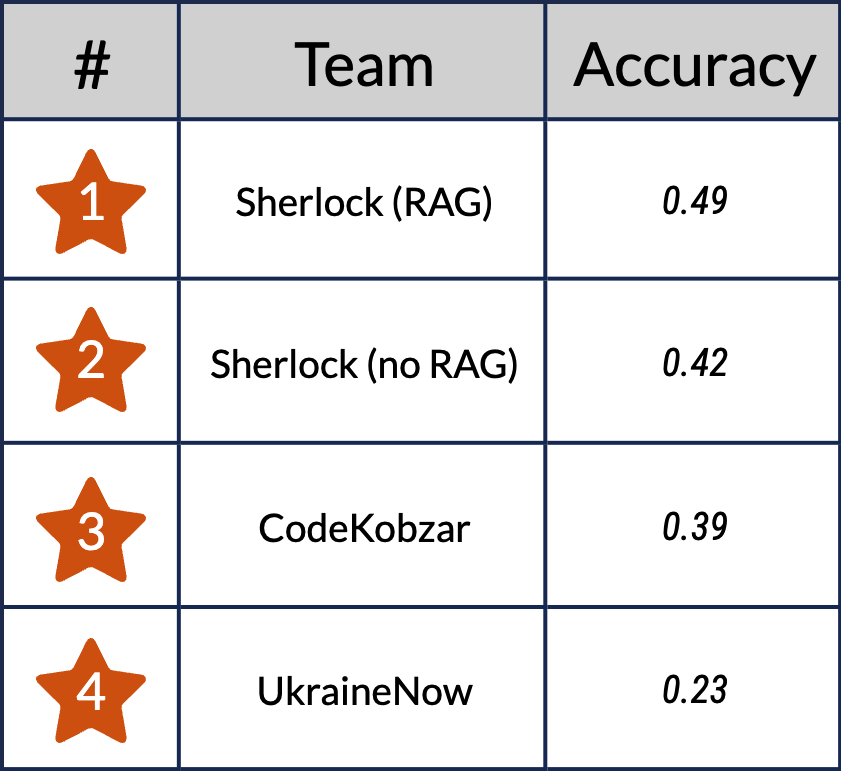
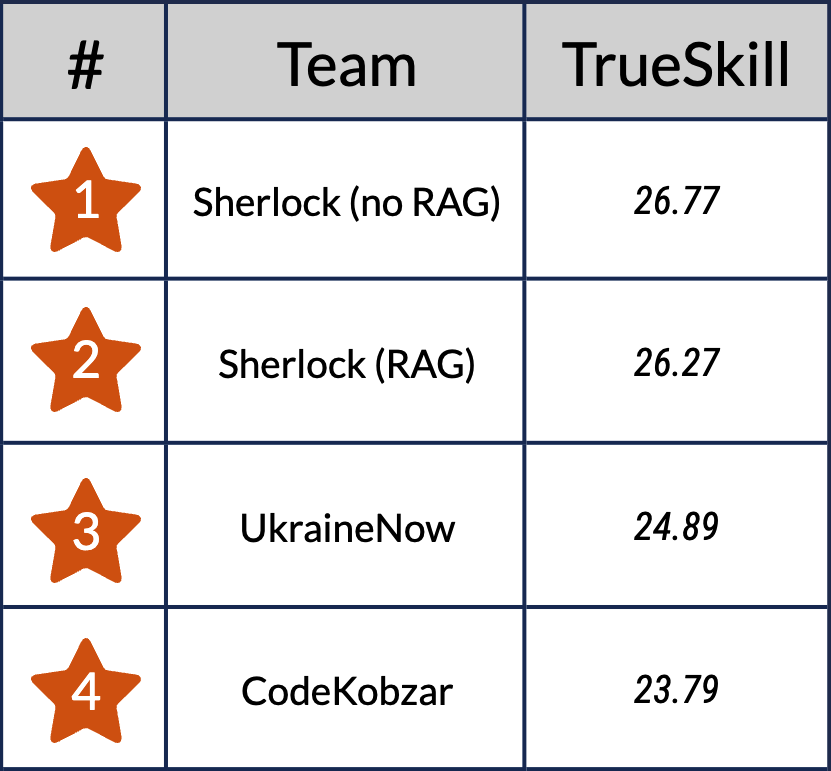

UNLP 2024 Shared Task on Fine-Tuning Large Language Models (LLMs) for Ukrainian
===============================================================================

The Third Ukrainian NLP workshop ([UNLP 2024](https://unlp.org.ua/))
organizes the first Shared Task on Fine-Tuning Large Language Models
(LLMs) for Ukrainian. This Shared Task aims to challenge and assess
LLMs' capabilities to understand and generate Ukrainian, paving the way
for LLM development in Slavic languages.

The task was held from January 15 till March 4, 2024. See the [results](#results) and
stay tuned for the full report on the shared task to be published at
UNLP 2024.

The [Codabench environment](https://www.codabench.org/competitions/2046/) remains open for further submissions, although
any such submissions will be considered outside of the UNLP 2024 competition.

Join the discussions in Discord via https://discord.gg/kCc6xgWbCJ.

Updates
-------

**2024-04-15**:

* Add annotation guidelines in [Ukrainian](./annotation/guidelines-uk.md).
* Add annotation guidelines in [English](./annotation/guidelines-en.md).

**2024-03-04**:

* [Results](#results) of the shared task announced.

**2024-03-03**:

* Release test data for [exam questions](./data/zno.test.jsonl).
* Release test data for [open questions](./data/open-questions.test.jsonl).

**2024-02-12**:

* Update important dates.
* Release training data for [exam questions](./data/zno.train.jsonl).
* Release sample [open questions](./data/open-questions.train.jsonl).

Task description
----------------

In this shared task, your goal is to instruction-tune a large language
model that can answer questions and perform tasks in Ukrainian. The
model should possess knowledge of Ukrainian history, language, and
literature, as well as common knowledge, and should be capable of
generating fluent and factually accurate responses.

Instruction tuning may be complemented by various prompting strategies,
like few-shot learning or chain-of-thought reasoning. You can also use
retrieval-augmented generation from open data sources.

We encourage you to use any open external data of your choice
(Wikipedia, textbooks, grammar books, etc.). One exception: if you want
to use data from the Ukrainian External Independent Evaluation (_ЗНО_),
please use only the subset we release below.

For an easy start with the data, consider the Ukrainian part of
the [aya_dataset](https://huggingface.co/datasets/CohereForAI/aya_dataset).

For an easy start with the model, consider [this guide](https://www.kaggle.com/code/philculliton/fine-tuning-with-llama-2-qlora) on fine-tuning with
Llama 2 using QLoRA.

Datasets
--------

We provide two datasets that you can use for tuning your models.
We will evaluate your models on a hidden set of similar data.

## 1. Exam questions

Data location: [`./data/zno.train.jsonl`](./data/zno.train.jsonl) or
https://huggingface.co/datasets/osyvokon/zno

This dataset contains machine-readable questions and answers from the
Ukrainian External Independent Evaluation (called _ЗНО_/_ZNO_ in Ukrainian).

The questions cover the following topics:
- History of Ukraine
- Ukrainian language and literature

The training set contains 3,063 question/answers. Every line in a .jsonl file
has the following structure:

```js
{
  "question": "На другий склад падає наголос у слові",
  "answers": [
    { "marker": "А", "text": "начинка" },
    { "marker": "Б", "text": "випадок" },
    { "marker": "В", "text": "дрова" },
    { "marker": "Г", "text": "загадка" },
    { "marker": "Д", "text": "русло" }
  ],
  "correct_answers": ["Д"],
  "subject": "ukrainian-language-and-literature"
}
```

Currently, all questions have exactly one correct answer (`correct_answers[0]`).


## 2. Open questions

Data location: [`./data/open-questions.train.jsonl`](./data/open-questions.train.jsonl).

This set contains instruction prompts for text generation tasks,
like text summarization, short story and poem generation, adding
explanations to a sample text, question answering, and so on.
The questions contain references to the history, culture, literature,
music, and geography of Ukraine, as well as cover multiple genres of
writing.

This set contains only 20 instruction prompts. A sample record from
the provided .jsonl file has the following structure:

```json
{
  "instruction": "Розкажи сюжет казки \"Котик і Півник\".",
  "input": "",
  "output": ""
}
```

`input` and `output` are currently empty and are provided for compatibility
with the Alpaca dataset format.

These questions don't have a single correct answer.


Limitations
-----------

To ensure fair competition with reproducible results, please adhere to
the following limitations:

1.  Only LLMs with open weights such as Llama 2, Mistral, Phi-2, Aya 101, etc.
    are allowed for the shared task.

2.  The model should be able to run on GPU with 16GB VRAM and CUDA
    compute capacity 8.6. Some examples of suitable GPUs include NVIDIA
    GeForce RTX 3080/4090, RTX A4000, and A2.

    - You are not limited in the type and amount of compute that you use for
      training.

    - The model weights and activations should fit and stay in GPU memory
      entirely. CPU memory and disk offloading is not allowed.

    - You can use external storage for retrieval-augmented generation and
      other non-parametric methods.

3.  The weights of the final model should be published on [the Hugging
    Face Hub](https://huggingface.co/) or a similar open platform.

4.  If you're going to train on the Ukrainian External Independent Evaluation
    (_ЗНО_) data, use [the provided data](./data/zno.train.jsonl) to avoid
    test set contamination.


Evaluation
----------

Model evaluation is twofold:

-   Automated evaluation — the **accuracy** of the model's answers to
    the multiple-choice exam questions. The questions are based on the
    Ukrainian External Independent Evaluation tasks related to the topics of
    Ukrainian history, language, and literature.

    We provide a sample of data that you can use for training and
    validating your model: [./data/zno.train.jsonl](./data/zno.train.jsonl).

    Test data (751 multiple-choice questions) is in [./data/zno.test.jsonl](./data/zno.test.jsonl).

    The Codabench space for submitting the results can be found at
    [https://www.codabench.org/competitions/2046/](https://www.codabench.org/competitions/2046/).

    We used the accuracy metric to rank the competing LLM solutions.

-   Human evaluation — **manual evaluation** of text generation tasks,
    like text summarization, short story and poem generation, adding
    explanations to sample text, question answering, free chat. Open
    questions contain references to the history, culture, literature,
    music, and geography of Ukraine, as well as cover multiple genres of
    writing. The evaluation was organized as a side-by-side comparison
    of random model outputs.

    Please find sample prompts in [./data/open-questions.train.jsonl](./data/open-questions.train.jsonl).

    A hundred open questions used for the final human evaluation are
    in [./data/open-questions.test.jsonl](./data/open-questions.test.jsonl)

    We collected more than 300 responses for each competing model and used
    the TrueSkill ranking system to define the winner. The annotation
    guidelines used for the side-by-side evaluation can be found [here](./annotation/guidelines-uk.md).


Baselines
---------

See [./examples/random_baseline.py](./examples/random_baseline.py) for
a very simple (and useless) baseline that always answers with the first
choice. This script contains code to load the dataset and to generate a
sample prompt. Use it to get the idea behind the data structure and
automated evaluation.

Results
----------

The First Shared Task on Fine-Tuning LLMs for Ukrainian is officially closed!

⭐ The winner in the exam task is Sherlock (RAG) achieving the accuracy of 0.49!

⭐ The winner in the open question task is Sherlock (no RAG) beating other solutions with 26.77 TrueSkill rating!


   

Full report on the shared task — TBD.


Publication
-----------

Participants in the shared task are invited to submit a paper to the
UNLP 2024 workshop. Please see the [UNLP website](https://unlp.org.ua/)
for details. Accepted papers will appear in the ACL anthology and will
be presented at a session of UNLP 2024 specially dedicated to the Shared
Task.

Submitting a paper is **not mandatory** for participating in the Shared
Task.

Important Dates
---------------

January 15, 2024 — Shared task announcement\
February 12, 2024 — Second call for participation; release of train data\
February 16, 2024 — Release of test data to registered participants\
February 24, 2024 — Registration deadline; release of open questions\
February 26, 2024 — Submission of system responses\
March 4, 2024 — Results of the Shared Task announced\
March 6, 2024 — Shared Task paper due\
March 27, 2024 — Notification of acceptance\
April 5, 2024 — Camera-ready Shared Task papers due\
May 25, 2024 — Workshop date

Contacts
--------

Email: oleksiy.syvokon@gmail.com

Discord: https://discord.gg/kCc6xgWbCJ

References
----------

- [UNLP 2024 Call for Papers](https://unlp.org.ua/call-for-papers/)
